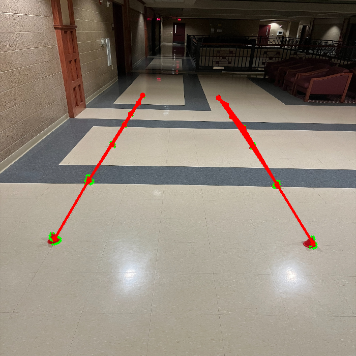

# WA_Perception_Challenge
Answer:

Methodology:
The methodology I used to get the answer is to first put a mask over
the image to isolate the colors of the cones. I then found that there
was too much noise due to small red pixels on the doors. I found some documentation
online that allowed me to fix this problem. I then looked up cluserting examples using
openCV and implemented what I saw to draw contours around the cones to cluser them together,
then using those contours as cones for the endpoints of each line. In order for the lines to 
only be drawn to cones in the same lane, I added a statement that they are only allowed to
draw lines to cones within 100 px of x position from each other.

What didn't work:
Originally I tried recalling what I knew from my past experience using opencv,
but I quickly found that it wasn't as useful in this case because I never
used color thresholding and clustering, so I had to learn a lot of new things.
An issue I ran in to at the beginning of the challenge was not applying a proper
mask for thresholding. There were two reasons for this; one being that I forgot
images follow BGR instead of RGB (stupid oversight I know), and the second being
that I established the thresholds for the range of the color orange, but the cones
show as more of a red color in the photo. Although a very simple fix, it was an 
admittedly big wall that stopped me from progress in the beginning as I thought
my code was going wrong somewhere within the more complex cluserting methods.
Once I fixed it, it was a much straighter path to completing the challenge.

Libraries Used:
cv2
numpy
matplotlib.pyplot
KMeans
